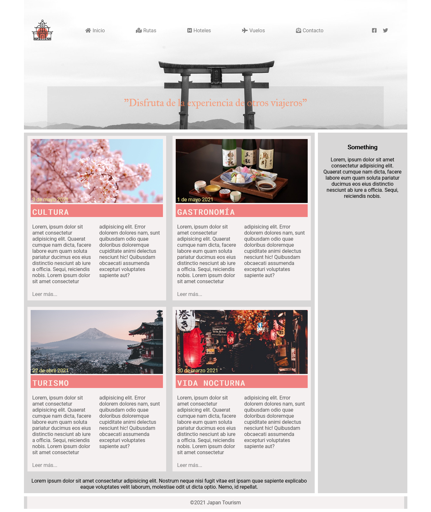

# Wireframing

---

## Description

In this practice you will need to make a layout that should work on desktop, mobile and tablet.

Please note the following considerations. These are common errors in deliveries:

- In general, we never set the height of a layer, but let the layer fit its content (if the layer has no content, you can set a height).

- The page should not have a horizontal scroll bar (if this happens to you, you should find out by inspecting the page which block is wider than the browser screen).

- Within a div there are usually other divs. Divs have display: block by default. This causes them to be placed vertically. Therefore, it is often not necessary to specify the following styles for an element to be something redundant:
  .element {display: flex; flex direction: column}

- On a div, the default width is for the entire wrapper layer, so you won't normally need to specify width: 100%

---

## Level 1 :star:

---

### Exercise 1

From the wireframe that we provide you in png format, you will have to make the layout in <b>desktop format</b>. The chosen colors are indifferent,
but it is very important that you make the box structure that we indicate.

The maximum width of the layer that will contain the entire layout has to be <i>1200px</i> (max-width:1200px).

Check the image below for a preview of the desired layout:

### Exercise 2

You need to start preparing for the adaptation to different devices, so you need to be clear about the concept of Media Query . Note that there is a change in the layout and color of some items.

Continuing with the previous project, make the tablet version as shown in the following screenshot:

### Exercises 3

As in the previous case, you will now need to adapt to the Mobile version. It has to look like this:

---

## LEVEL 2 :star::star:

**Reference for exercises 4 and 5**

Below is a sample of what the final layout of the page would look like:

### Exercises 4

In this part we want you to work on the header and graphics. You will need to add icons and a logo as well as a background image. Replace the respective quadrants so that the new header looks like this tourism website in Japan:

It is important to consider the following:

- Clickable options must have a roll-over effect.

- Media queries created in the previous activity must be maintained.

- The text "Enjoy ..." is semi-transparent.

- The logo and the bottom of the header, you have them attached to the activity. You will need to find the rest of the graphics and make them as similar as possible.

- You can get the menu icons from -> [font awesome](https://fontawesome.com/).

### Exercises 5

In this exercise you will have to add the section of the articles following this graphic:

## 

## LEVEL 3 :star::star::star:

### Exercises 6

CONGRATULATIONS! You have created a complete website, but as you can see, it is very static. To enhance the user experience, apply an animation using keyframes to the main elements of the web, title and logo .

### Exercises 7

Do you see yourself able to do the same job but with grid layout? So the goal of this work is to use the properties of grid layout to make the whole structure of the web and its different devices (always with Media Query).

If you want, you can consult the optional grid layout material on campus.
